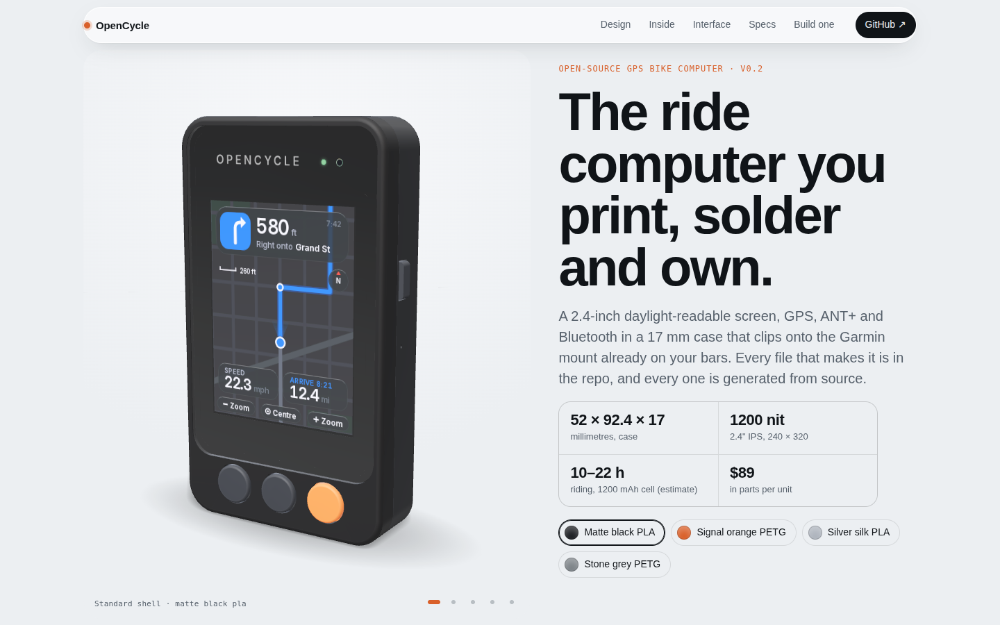
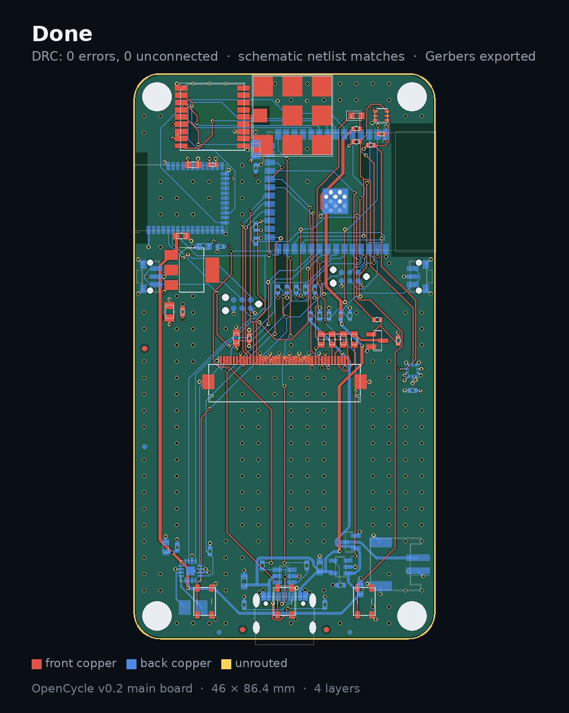
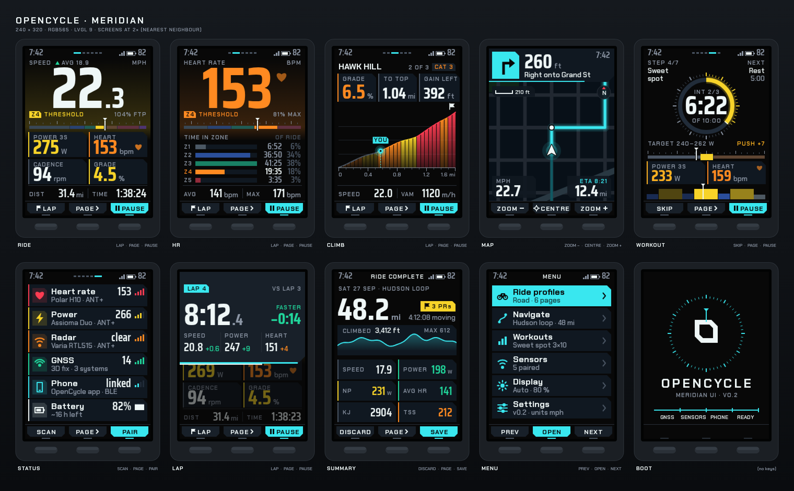

# OpenCycle

An open-source GPS bike computer you print, solder and own.



- **Screen:** 2.4" IPS TFT, 240 × 320, 1200 nit (Newhaven, ST7789), auto-dimmed by an ambient-light sensor.
- **Radios:** ESP32-S3 (Wi-Fi, Bluetooth to the phone, native USB) + Ezurio BL652 for ANT+ and Bluetooth sensors + u-blox MAX-M10S GPS with a 12 mm ceramic patch.
- **Also:** BMP581 barometer, I²S amp and sealed speaker, 3 soft keys + 2 side buttons, USB-C charging.
- **Battery:** 1200 mAh LiPo, ~10–22 h riding (estimate, not measured).
- **Case:** 52 × 92.4 × 17 mm, FDM-printed, Garmin quarter-turn mount; standard, aero and rugged shells.
- **Parts:** ~$89 per unit, every part priced and linked (Mouser + Digi-Key).

Everything is generated from source: the enclosure (CadQuery), the board **and** its schematic (KiCad 7 through Python + Freerouting), the BOMs, the print files and the 3D viewer.

## Status (v0.2)

| Area | State |
|---|---|
| Enclosure | Done. Fit-checked against placeholders and against every real part on the routed board. Print-ready STLs in [`print/`](print/README.md). |
| PCB | Routed, 4 layers. **DRC 0 errors / 0 unconnected**, ERC 0 errors, schematic netlist = board netlist. Gerbers, BOM and CPL in [`pcb/fab/`](pcb/fab). |
| Parts | Complete BOM with prices, links and specs: [`docs/sourcing/bom-v0.2.md`](docs/sourcing/bom-v0.2.md). |
| UI | "Lucent" design language, 10 screens: [`docs/UI.md`](docs/UI.md). |
| Firmware | Not started. The owner is finishing the UI first. Plan: [`docs/FIRMWARE.md`](docs/FIRMWARE.md). |

> **Ready to order a first prototype run, not yet built.** Nothing has been soldered or powered up. Treat the first five boards as prototypes and read the "not verified" list in [`pcb/README.md`](pcb/README.md) (RF, battery lead polarity, JLCPCB part rotations) before you pay.

## Build one

Step-by-step guides are in [`instructions/`](instructions/README.md):

1. [Order the parts](instructions/01-order-parts.md)
2. [Order the PCBs](instructions/02-order-pcb.md)
3. [Print the case](instructions/03-print-case.md)
4. [Assemble the board](instructions/04-assemble-board.md)
5. [Bring it up](instructions/05-bring-up.md)
6. [Final assembly](instructions/06-final-assembly.md)
7. [Next steps](instructions/07-next-steps.md)

## The board



A time-lapse of the board being generated (placement, fan-out, routing, pours) is in [`docs/media/pcb_timelapse.mp4`](docs/media/pcb_timelapse.mp4).

## The interface



## What's here

| Path | What it is |
|---|---|
| `cad/` | Parametric enclosure (CadQuery). `params.py` holds every dimension; `check_fit.py` and `board_fit.py` check it. |
| `pcb/` | `design.py` (parts, nets, placement, rules) → board, schematic, fab files. Status in `pcb/README.md`. |
| `print/` | Print-oriented STLs, STEP files and the cover-lens outline. |
| `viewer/` | three.js pages: `index.html` (studio viewer with net explorer) and `product.html` (product page). The Lucent reference renderer is `viewer/ui/screens_color.js`. |
| `instructions/` | How to order, build and bring up a unit. |
| `docs/` | Hardware, PCB, CAD, UI, sourcing and decision docs. Start with [`docs/README.md`](docs/README.md). |
| `tools/` | `build_all.sh` rebuilds everything; exporters for meshes, print files, BOM and the time-lapse. |
| `AGENTS.md` | Where the truth lives and what not to break, for AI agents and new contributors. |

## Quick start

```bash
# view the product (the generated assets are committed)
python3 -m http.server -d viewer 8000     # open http://localhost:8000/product.html or /index.html

# rebuild everything (CadQuery, KiCad 7, Java for Freerouting; see docs/SETUP.md)
./tools/build_all.sh
```

## Licence

No licence file has been chosen yet; until one is added, all rights are reserved by the author. The Inter typeface in `viewer/ui/fonts/` is used under the SIL Open Font License (`OFL-Inter.txt`).
