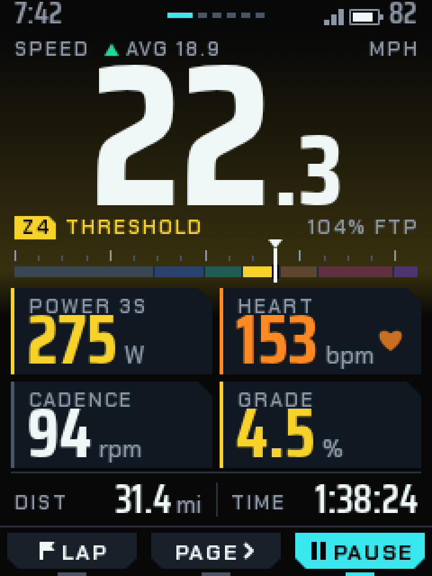
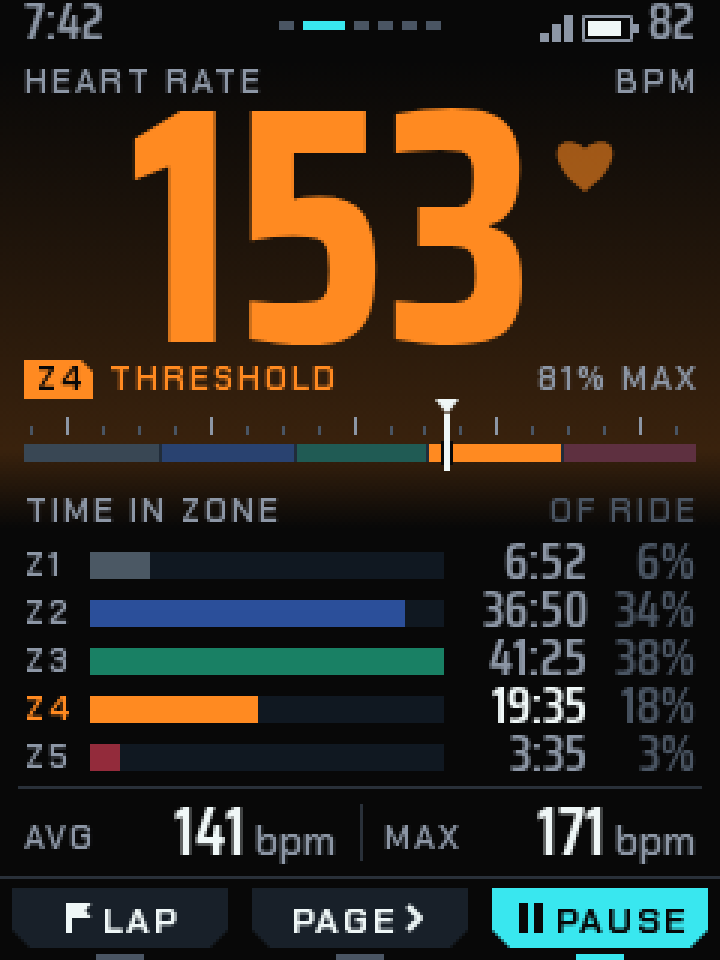
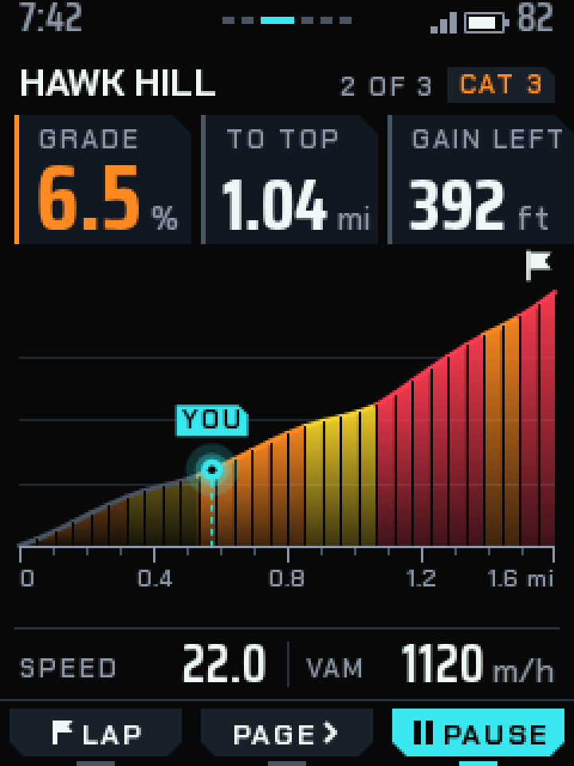
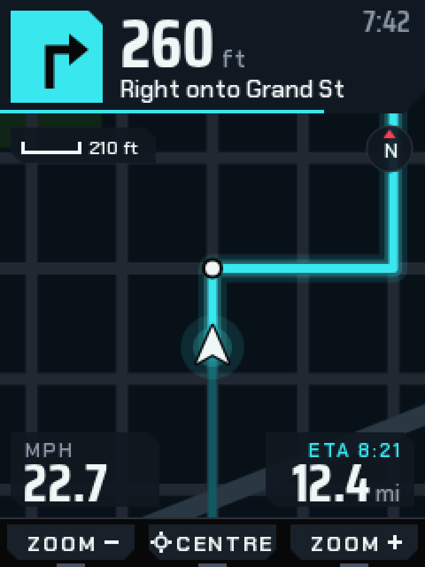
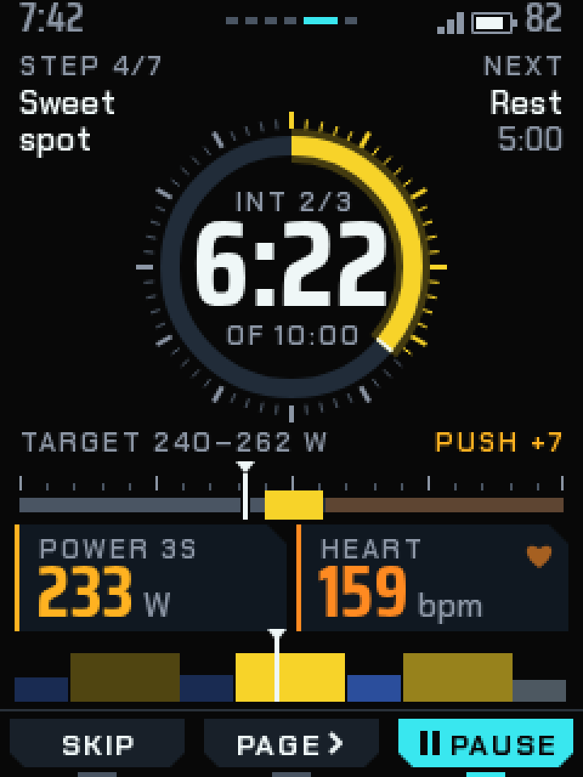
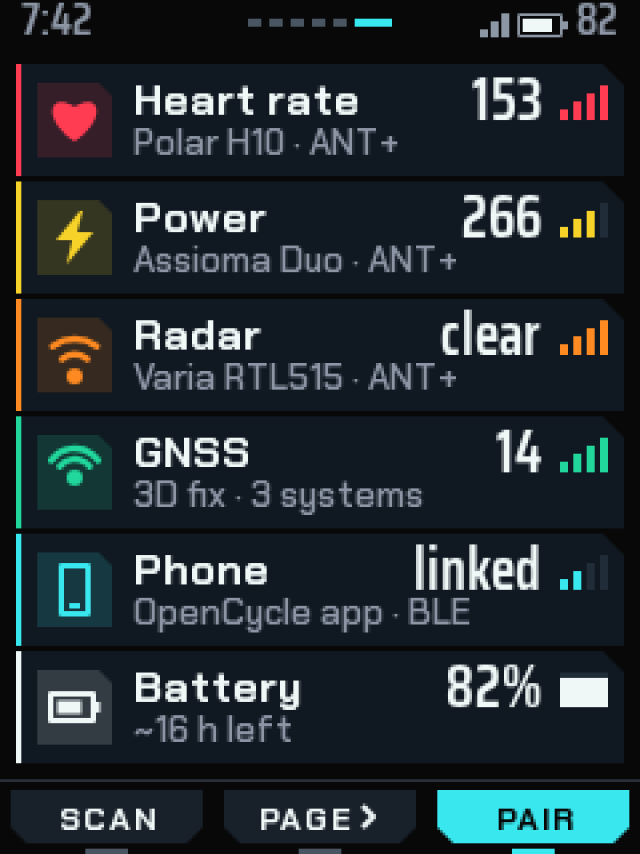
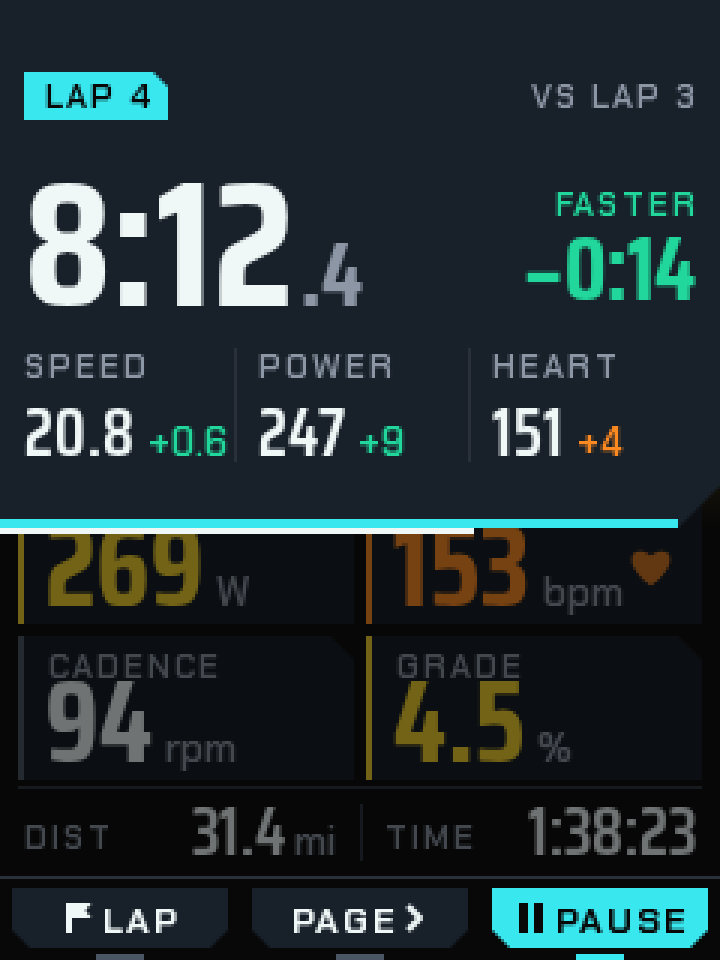
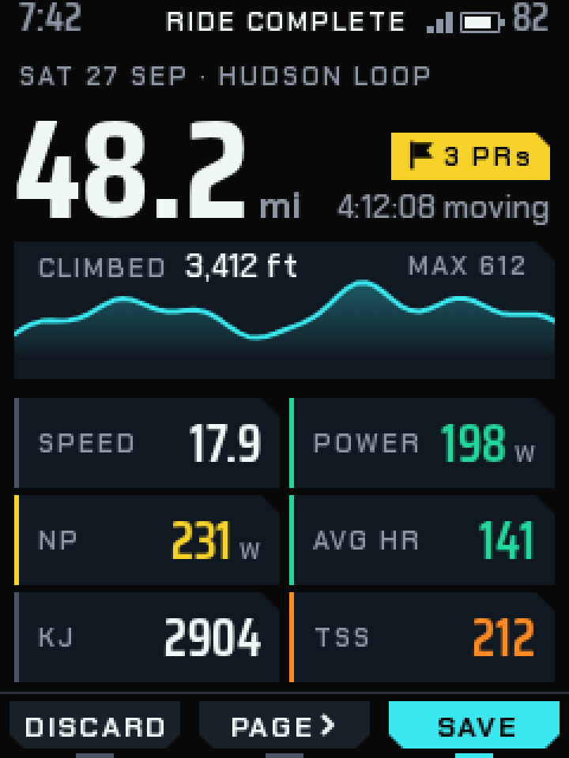
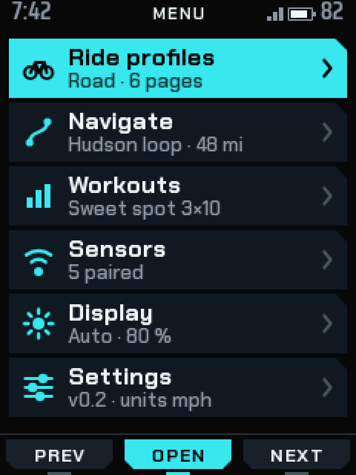
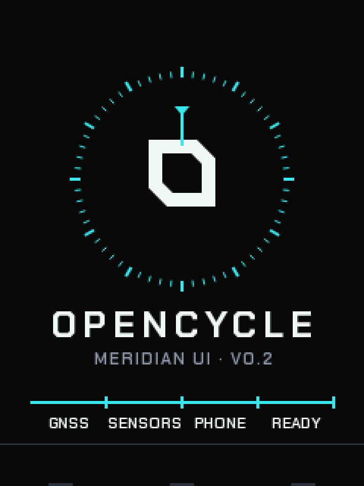

# On-device UI — "Meridian"

**Status:** design reference. Rendered in the browser only; no firmware yet. Pixel values in this document were checked against the renderer, not against the panel.

- **Source of truth:** [`viewer/ui/screens_color.js`](../viewer/ui/screens_color.js). The 3D viewer and the screenshots below both render from it, and the firmware (LVGL 9 on the ESP32-S3) ports it 1:1. If this document and the code disagree, the code wins. Fix the document.
- **Screenshots:** [`docs/ui/`](ui/). `overview.png` shows every screen, and each screen also has `<id>.png` (1×) and `<id>@3x.png`. To regenerate them, serve the repo root with `python3 -m http.server 8765`, then run `node docs/ui/shoot.mjs`. The script needs Playwright (Chromium) installed locally or globally. [`docs/ui/harness.html`](ui/harness.html) sets the frame time used for each screen.
- The monochrome renderer for the old Sharp memory LCD, `viewer/ui/screens.js`, is legacy. The v0.2 hardware uses the colour TFT.


## Display facts

| | |
|---|---|
| Panel | Newhaven NHD-2.4-240320AF-CSXP, 2.4" IPS TFT, ST7789, 1200 nit |
| Resolution | **240 × 320 px, portrait**. Active area ≈ 36.7 × 49 mm, ≈ 166 ppi (1 px ≈ 0.153 mm) |
| Colour | RGB565 in firmware (the panel can take 18-bit colour; we send 16-bit) |
| Frame buffer | 240 × 320 × 2 = 150 KB. Use two partial LVGL draw buffers of 240 × 40 in internal RAM, and put fonts and bitmaps in flash or PSRAM |
| Input | 3 unlabelled front keys under the screen (L / C / R), a left side button (power/back) and a right side button (menu) |

## 1. Design language: Meridian

*A precision instrument that comes from the future.* A meridian is the reference line an instrument reads against. On this UI, every quantity is read against a scale.

Principles:

1. **One hero, one rail.** Each data page has one oversized number, with the **Meridian rail** under it: a tick scale with a segmented colour band and a needle. The rail is the signature component and appears on ride, heart, workout, climb (as the distance axis) and boot.
2. **Colour is state, never decoration.** The chrome is neutral ink and grey. Chroma only appears when it carries meaning: effort zone, gradient, the primary action, or the route. A value is drawn in the colour of its current zone.
3. **The notch.** Every panel, key cap and card has a 45° chamfer (8 px on panels, 6 px on keys, 12–14 px on cards) instead of a round radius. This gives the UI its silhouette, and the Chakra Petch letterforms repeat the same cut.
4. **Light as signal.** The only "glow" is the **halo**: the current zone colour rising from transparent to 20 % opacity toward the rail and falling off below it. The route and the rider on the map get two stacked translucent strokes. There is no blur anywhere.
5. **Mechanical motion.** Needles and bars follow the data. Overlays drop in with a small overshoot and retract on a visible timer. Nothing loops just for show, except the heartbeat, which beats at your real heart rate.
6. **Glanceable first.** Hero numerals are 112 px (≈ 12 mm cap height). Field values are at least 30 px, labels at least 10–11 px, and every key label sits over its key.

## 2. Palette

Every value is RGB565-exact, so the hex shown is what the panel displays. Define these in one `theme.h` table.

| Token | Hex | RGB565 | Use |
|---|---|---|---|
| `bg` | `#080808` | `0x0841` | screen background ("ink") |
| `s1` | `#101821` | `0x10C4` | surface: panels, fields, list rows, map chips |
| `s2` | `#182029` | `0x1905` | raised: key caps, lap card |
| `s3` | `#212C39` | `0x2167` | tracks: empty rail, bezel ring, bar backgrounds |
| `line` | `#293039` | `0x2987` | 1 px hairlines and dividers |
| `dim` | `#4A5563` | `0x4AAC` | minor ticks, inactive glyphs, neutral spines |
| `mute` | `#8C96A5` | `0x8CB4` | labels, units, major ticks |
| `text` | `#EFF7F7` | `0xEFBE` | primary text, needles, rider |
| `ion` | `#39E7EF` | `0x3F3D` | **signature accent**: primary key, route ahead, focus, page dash, rider marker |
| `ionDim` | `#105963` | `0x12CC` | route already travelled |
| `pause` | `#FFB221` | `0xFD84` | paused, off target, low battery |
| `z1` | `#7B8E9C` | `0x7C73` | Z1 recovery |
| `z2` | `#427DFF` | `0x43FF` | Z2 endurance |
| `z3` | `#21D79C` | `0x26B3` | Z3 tempo / "good" / faster |
| `z4` | `#F7D329` | `0xF685` | Z4 threshold |
| `z5` | `#FF8A21` | `0xFC44` | Z5 VO2 |
| `z6` | `#FF3C52` | `0xF9EA` | Z6 anaerobic |
| `z7` | `#C64DFF` | `0xC27F` | Z7 neuromuscular |
| `mapBg` | `#081018` | `0x0883` | map ground |
| `road` | `#212831` | `0x2146` | streets (6 px at zoom 1) |
| `roadMajor` | `#293842` | `0x29C8` | arterials (10 px) |
| `water` | `#082031` | `0x0906` | water |
| `park` | `#102418` | `0x1123` | parks |

Colour mappings:

- **Power zones** (Coggan, fraction of FTP): Z1 < 0.55 ≤ Z2 < 0.75 ≤ Z3 < 0.90 ≤ Z4 < 1.05 ≤ Z5 < 1.20 ≤ Z6 < 1.50 ≤ Z7. Colours `z1`…`z7`.
- **HR zones** (fraction of max HR): Z1 0.5–0.6 `z1`, Z2 0.6–0.7 `z2`, Z3 0.7–0.8 `z3`, Z4 0.8–0.9 `z5`, Z5 0.9–1.0 `z6`.
- **Gradient:** < 3 % `z3`, 3–6 % `z4`, 6–9 % `z5`, 9–12 % `z6`, ≥ 12 % `z7`.
- Inactive rail segments are drawn at **28 % opacity** (`LV_OPA_30` is close enough). Past workout steps are drawn at 30 %, future steps at 60 %.

## 3. Type

Two OFL families, bundled in [`viewer/ui/fonts/`](../viewer/ui/fonts/) with their `OFL-*.txt` licences:

- **Saira Condensed** (Medium 500 / SemiBold 600 / Bold 700) for numerals. It is condensed, squared and technical, so large numbers still fit 240 px.
- **Chakra Petch** (Medium / SemiBold / Bold) for labels and text. Its chamfered letterforms echo the notch.

Each row below becomes one `lv_font_conv` font at `--bpp 4`. The letter spacing is applied with the LVGL style `text_letter_space`, not baked into the font.

| Token | Family / weight | px | Letter space | Used for | `lv_font_conv` `--range` |
|---|---|---|---|---|---|
| `hero` | Saira Cond. Bold | 112 | 0 | ride speed (integer part), HR hero | `0x30-0x39,0x2D` |
| `dec` | Saira Cond. Bold | 56 | 0 | decimal part of the hero (".3") | `0x2E,0x30-0x39` |
| `xl` | Saira Cond. Bold | 60 | 0 | lap time, summary distance | `0x2E,0x30-0x3A` |
| `timer` | Saira Cond. Bold | 50 | 0 | workout countdown | `0x30-0x3A` |
| `lg` | Saira Cond. Bold | 38 | 0 | 2 × 2 field values | `0x2D,0x2E,0x30-0x39` |
| `md` | Saira Cond. Bold | 30 | 0 | secondary values, turn distance, lap delta | `0x20,0x2B-0x3A,0x2212` |
| `sm` | Saira Cond. SemiBold | 22 | 0 | footer values, list values, spec sheet | `0x20-0x7E,0x2013,0x2212` |
| `xs` | Saira Cond. SemiBold | 17 | 0 | status-bar clock and battery, zone times | `0x20-0x7E` |
| `title` | Chakra Petch Bold | 16 | 0 | list item names, climb name | `0x20-0x7E,0xB7,0xD7,0x2013` |
| `body` | Chakra Petch SemiBold | 13 | 0 | secondary text, units | `0x20-0x7E,0xB7,0xD7,0x2013` |
| `label` | Chakra Petch SemiBold | 11 | 1 | UPPERCASE micro labels | `0x20-0x5F,0xB7,0x2013,0x2212` |
| `key` | Chakra Petch Bold | 12 | 1 | soft-key labels (uppercase) | `0x20-0x5F,0x2212` |
| `axis` | Chakra Petch SemiBold | 10 | 0 | tick numbers and small units only | `0x20-0x7E` |

Example conversion:

```
lv_font_conv --font SairaCondensed-Bold.ttf --size 112 --bpp 4 --format lvgl \
  --range 0x30-0x39,0x2D --no-compress -o font_num_hero.c
```

Rules:

- Labels are always UPPERCASE with 1 px tracking in `mute`.
- Values never use Chakra Petch, and labels never use Saira.
- The hero is drawn as an integer (`hero`) followed by the decimal (`dec`) on the same baseline, and the pair is centred as one unit.
- **Licence note:** Saira has a Reserved Font Name. Converting it to an LVGL bitmap font arguably makes a derived font, so name the C symbols neutrally (`font_num_hero`, not `saira_…`), and ship `OFL-SairaCondensed.txt` and `OFL-ChakraPetch.txt` with the firmware.

## 4. Spacing and grid

- **Unit 4 px.** Screen margin 8 px for text and 6 px for panels. Gutter between panels 4 px.
- Hairlines are 1 px `line`. Spines are 2 px. Needles are 2 px.
- **Vertical skeleton of a data page:**

| Band | y range | Contents |
|---|---|---|
| Status bar | 0 – 18 | clock · page dashes or title · GPS · battery |
| Hero label row | baseline 31 | label left, unit right |
| Hero | baseline 114 | 112 px numerals (cap top ≈ y 36) |
| Rail label row | baseline 130 | zone badge left, % right |
| Rail | 133 – 156 | cap 133–138, ticks 138–144, band 148–154 |
| Content | 160 – 260 | fields / lists |
| Footer | 262 – 291 | 1 px rule at 262, values baseline 285 |
| **Soft-key bar** | **292 – 320** | reserved on every screen, including boot |

## 5. Components

All sizes are in px at 1×.

**Status bar** (`statusBar`, 0–18). Clock in `xs mute` at (8, baseline 13). On pages in the PAGE cycle, the centre shows **page dashes**: 3 px tall, the current dash 14 px `ion` and the others 5 px `dim`, with 3 px gaps, centred at y 7–10. Other screens show a `label`-style title in `text` in the centre instead. GPS is three rising bars 3 px wide at x 180/184/188 (heights 3/6/9, bottoms at y 14). The battery is a 17 × 9 outline in `mute` at (194, 5) with a 2 × 3 cap, filled in `text` (or `pause` below 20 %). The percentage is in `xs mute`, right-aligned at x 232.

**Soft-key bar** (`softkeys`, y 292–320, the fixed contract).

- Three cells of 80 px, one per physical key (L 0–80, C 80–160, R 160–240), with a 1 px `line` rule at y 292.
- Each cell has a **key cap** of 72 × 20 at (cell + 4, 296), with both bottom corners notched 6 px. The notch "points" at the key.
- Label in `key`, centred over the cell (baseline y 310.5), optionally with a 8–10 px glyph: pause ❚❚, play ▶, flag (LAP), chevron › (PAGE), − / + (ZOOM), crosshair (CENTRE).
- A **locator tick** of 16 × 2 at (cell centre − 8, 318) sits right above the physical key: `ion` on the primary key, `dim` otherwise, `line` on an empty cell.
- **Primary key:** cap filled `ion`, label and glyph in `bg`. Other keys: cap `s2`, label `text`.
- **Empty label** (boot): no cap, only the locator tick.

**Panel / field** (`field`).

- Notched rect (top-right corner cut 8 px) filled `s1`, with a 2 px **spine** on the left edge in the value colour. Neutral values get a `dim` spine.
- `label` at (x + 10, y + 14).
- Value at (x + 9, baseline y + h − 6), in `lg` (fields of 48 px or taller) or `md` (44 px).
- Unit in `body mute`, 4 px after the value. Alternatively, in the label row, right-aligned at x + w − 10.
- Standard ride field: **112 × 48**, at x 6 and x 122, y 160 and y 212.

**Meridian rail** (`rail(x, y, w, {min, max, value, bands, minor, major, window})`), 23 px tall starting at `y`. This is the signature component.

- **Ticks** (above the band): minor 1 × 3 `dim` at y + 3, major 1 × 6 `mute` at y.
- **Band:** at y + 9, height 6, over an `s3` track. Segments are separated by 1 px of track. The active segment is drawn at 100 %, the others at 28 %.
- **Target window** (workout): the target segment stays lit, and extends 3 px above and below the band in its colour, bracketed with 2 px ends.
- **Needle:** 2 × 19 px `text` at the value's x, starting at y − 1. A 1 px `bg` gap either side cuts it out of the band. The cap is a 8 × 5 downward triangle at y − 6.
- Ride: 0 … 1.6 × FTP, minor 25 W, major 100 W. Heart: 0.5 … 1.0 × max HR, minor 5, major 20. Workout: 150 … 350 W, minor 10, major 50.

**Zone badge.** A notched chip 13 px tall (4 px notch, top-right) in the zone colour, holding `Z4` in `label bg`, followed 5 px later by the zone name in `label` in the zone colour.

**Halo.** Two stacked vertical gradients over the full width: y 20 → 150 goes from zone colour at 0 % to 20 %, and y 150 → 176 goes from 20 % back to 0 %. The rail sits at the brightest line.

**Bezel** (workout, boot).

- Radius r = 52 around (120, 110): 60 ticks from r + 5 to r + 9 (minor, 1 px `dim`), with every 5th tick running to r + 12 (2 px `mute`). Ticks already passed turn to the arc colour.
- Ring track 8 px `s3` at r − 2.
- Progress arc 8 px in the target-zone colour, starting at 12 o'clock and running clockwise, over a 14 px glow at 25 %. The arc has a 2° `text` end-cap.

**Chip** (map overlays). A notched rect in `s1` at 92 % opacity, with the top-right and bottom-left corners notched 6 px.

**Icons.** 20 × 20 single-colour glyphs (heart, bolt, crank, sat, phone, battery, radar, route, bike, chart, sliders, sun, flag, mountain). They are drawn as paths in the renderer. The firmware exports them as A8 bitmaps and recolours them (`img_recolor`).

## 6. Screens

The PAGE key cycles ride → heart → climb → map → workout → sensors. The right side button opens the menu, and the left side button goes back or powers off.

| id | Screen | Keys L / C / R | Primary |
|---|---|---|---|
| `ride` | Ride | LAP / PAGE / PAUSE | R |
| `hr` | Heart | LAP / PAGE / PAUSE | R |
| `climb` | Climb | LAP / PAGE / PAUSE | R |
| `map` | Navigation | ZOOM − / CENTRE / ZOOM + | none (all neutral) |
| `workout` | Workout | SKIP / PAGE / PAUSE | R |
| `status` | Sensors | SCAN / PAGE / PAIR | R |
| `lap` | Ride + lap overlay | LAP / PAGE / PAUSE | R |
| `summary` | Ride summary | DISCARD / PAGE / SAVE | R |
| `menu` | Menu | PREV / OPEN / NEXT | C |
| `boot` | Boot | (none) | none |

While paused, the right key becomes **START** with the play glyph, and the halo and every zone colour switch to `pause`. This state is not rendered yet.

### ride

- Halo in the power-zone colour.
- Label row at baseline 31: `SPEED` at x 8. Next to it is a 8 × 7 trend triangle at x 58 (▲ `z3` if above average, ▼ `z5` if below), followed by `AVG 18.9` at x 70. `MPH` is right-aligned at x 232.
- Hero speed centred at x 120, baseline 114, drawn as `hero` + `dec`.
- Zone badge at (8, 130). `104% FTP` in `label mute`, right-aligned at x 232.
- Rail at (8, 139), 224 px wide.
- Fields, 112 × 48:
  - POWER 3s at (6, 160), in the zone colour.
  - HEART at (122, 160), in the HR-zone colour, with a 14 px heart at (x + 88, y + 22) that beats at the current HR.
  - CADENCE at (6, 212), in `text` with a `dim` spine.
  - GRADE at (122, 212), in the gradient colour.
- Footer: DIST and TIME.

### hr

- Same skeleton as ride. The hero is HR in the HR-zone colour, centred 10 px to the left to make room for a 22 px beating heart at (hero right + 6, 44).
- Rail: HR zones.
- `TIME IN ZONE` label at baseline 174. Five rows start at y 182 with a 16 px pitch. Each row has:
  - the zone id (`label`) at x 8
  - a 118 × 9 bar at x 30, on `s1`, scaled to the largest zone and drawn at 55 % unless it is the current zone
  - the time in `xs`, right-aligned at x 196
  - the share in `xs dim`, right-aligned at x 232
- Footer: AVG and MAX.

### climb

- Name in `title` at (8, 40). A `CAT 3` notched chip sits top-right, with `2 OF 3` to its left.
- Three fields of 74/74/78 × 54 at y 48:
  - GRADE, in `lg` and the gradient colour
  - TO TOP, in `md`
  - GAIN LEFT, in `md`
- Profile over x 8–232, y 122–228:
  - 30 segments, each filled with a vertical gradient from its gradient colour at 95 % to 22 %.
  - A 2 px top line per segment, and 1 px `bg` gaps between segments.
  - Segments already climbed are drawn at 35 % / 6 %, with a `dim` top line.
  - Guide lines at 25 / 50 / 75 %. Summit flag in the top-right corner.
- Distance axis: this is the rail motif. A 1 px `mute` base line with 16 subdivisions (3 px minor ticks, 6 px major ticks) and `axis` labels at baseline 245.
- Rider:
  - `ion` dot, r 4.5, with a 1.8 px `bg` centre, over halos of r 7 at 35 % and r 11 at 18 %.
  - A dashed 1 px `ion` drop line down to the axis.
  - A `YOU` chip 30 × 13 placed 27 px above the dot.
- Footer: SPEED, VAM (m/h).

### map

- Full-bleed dark map (heading-up) clipped to y 0–292. The rider sits at (120, 196).
- **Route ahead:** 5 px `ion` over glow strokes of 10 px at 25 % and 16 px at 12 %. **Route behind:** 5 px `ionDim`.
- Next turn point: a 4 px `text` dot inside a 6 px `bg` ring.
- **Rider:** a chevron (18 × 21) filled `text` with a 2.5 px `bg` outline, over two `ion` halo discs (r 11 at 22 % and r 18 at 12 %).
- **Cue card:** 240 × 64 `s1`, bottom-right notch 12.
  - Manoeuvre tile 52 × 52 `ion` at (6, 6) with a `bg` arrow (5 px stroke).
  - Distance in `lg` at (68, 38), with the unit in `body mute`.
  - Instruction in `body` at (68, 55).
  - Clock in `xs mute`, top-right.
  - A 2 px `ion` progress bar along y 62 fills as the turn approaches (full at 0 ft, empty at ≥ 400 ft).
- Scale chip 82 × 20 at (6, 72). North chip r 13 at (220, 84), with a red triangle rotated to −heading.
- Bottom chips, each 84 × 42 at y 244:
  - Left: `MPH` label and speed in `md`.
  - Right: `ETA 8:21` in `label ion`, and the remaining distance in `md`.
- Keys: zoom out / re-centre / zoom in. Zoom steps are 0.5×, 1×, 2× and 4×, animated 250 ms.

### workout

- Corner text:
  - Top-left: `STEP 4/7`, then `Sweet` / `spot` in `body`, at y 31/47/62.
  - Top-right: `NEXT`, then `Rest` / `5:00`.
- Bezel at (120, 110), r 52, coloured by the target zone. Inside it: `INT 2/3` label at y 87, the countdown in `timer` at baseline 126, and `OF 10:00` at 142.
- Target row at baseline 186: `TARGET 240–262 W`, with the state right-aligned:
  - `ON TARGET` in `z3`
  - `PUSH +n` or `EASE −n` in `pause`
- Rail at (8, 196) with the target window.
- Fields, 112 × 44 in `md`, at y 216:
  - POWER 3s, coloured by the target zone when on target and `pause` when off it
  - HEART
- Session chart over x 6–234, baseline y 289, max height 22 px:
  - One block per step, width ∝ duration, height ∝ intensity, coloured by zone.
  - Past steps at 30 %, the current step at 100 %, future steps at 60 %.
  - Cursor: a 2 px `text` line with a triangle cap.

### status (sensors)

- Six rows of 228 × 42 with a 44 px pitch, starting at y 24. Each row has:
  - a notched `s1` panel with a 2 px spine in the sensor colour
  - a 28 × 28 icon tile at (14, y + 7), holding the icon at 16 % tint
  - the name in `title` at (50, y + 19) and the detail in `body mute` at (50, y + 34)
  - the value in `sm`, right-aligned at x 203 (baseline y + 21)
  - four signal bars, 3 px wide on a 5 px pitch, 4–13 px tall, at x 210 (empty bars in `s3`)
- The battery row shows a 18 × 13 fill gauge in place of the signal bars.

### lap (overlay over ride)

- The ride page underneath gets a `bg` scrim at 55 %.
- Card: 240 × 176 `s2`, bottom-right notch 14, with a 3 px `ion` rule along the bottom edge.
- Contents:
  - `LAP 4` chip (48 × 16, `ion`) at (8, 24), and `VS LAP 3` on the right.
  - Lap time in `xl` at baseline 102, with tenths in `md mute`.
  - Delta `−0:14` in `md`, right-aligned (`z3` if faster, `z5` if slower), with `FASTER` above it.
  - Three stat columns on a 78 px pitch: label at 126, value in `sm` at 152, delta in `body` coloured good/bad.
- A 2 px `text` **dismiss timer** under the card shrinks from full width to 0 over the hold.

### summary

- Title `RIDE COMPLETE` in the status bar. Date and route label at baseline 36.
- Distance in `xl` at baseline 92, with `mi` in `title mute`. `3 PRs` chip in `z4` on the right, and the moving time under it.
- Elevation card 228 × 58 at (6, 102): the trace is a 2 px `ion` line over an `ion` vertical gradient going from 45 % to 2 %.
- Spec sheet: six rows of 112 × 38 (2 columns at x 6 and 122, y 168/209/250). Each row has a label on the left and the value in `sm`, right-aligned at x + 104, with an optional unit in `axis`.

### menu

- Six rows of 228 × 40 with a 43 px pitch, starting at y 26. Each row has:
  - a 20 px icon in `ion` at (16, y + 10)
  - the name in `title` at (46, y + 18) and the detail in `body mute` at (46, y + 33)
  - a chevron at x 218
- **Selection bar:** the same notched shape filled `ion`, with its contents inverted to `bg`. It slides between rows in 180 ms (ease-out).
- Keys: PREV / OPEN / NEXT. The left and right keys move the selection, the centre key opens.

### boot

- Bezel at (120, 118), r 62, without the ring track.
- The logo mark is a notched square ring (stroke 9, outer 44 px, notches top-right and bottom-left) with an `ion` meridian needle above it. Firmware draws it as one A8 bitmap.
- `OPENCYCLE` in Chakra Petch Bold 24 with 4 px tracking, at baseline 222. `MERIDIAN UI · V0.2` in `label` at 240.
- Check rail at y 264, x 20–220, with four stops: GNSS / SENSORS / PHONE / READY.

## 7. Motion

Every animation is a pure function of time. In the renderer, `t` is in seconds. On device, drive each one with `lv_anim` or a data update.

| What | Duration / period | Easing | Notes |
|---|---|---|---|
| Value changes (numbers) | instant at 1 Hz sensor rate | none | Never tween numbers, because a rolling number reads as the wrong value |
| Rail needle, bars, arc | 300 ms per update | ease-out (`lv_anim_path_ease_out`) | animate the x position / arc end only |
| Heartbeat icon | one beat per 60/HR s | exp decay: scale 1 + 0.18·e^(−7φ), opa 55 → 100 % | use two prebuilt sizes (100 % and 118 %) and swap them, rather than scaling a bitmap |
| Lap card in | 400 ms | overshoot (back, s = 1.4; `lv_anim_path_overshoot`) | the card grows downward on overshoot so the top edge never uncovers |
| Lap card hold | 4.0 s | linear | the dismiss hairline shrinks over the hold |
| Lap card out | 400 ms | ease-in | scrim fades with it |
| Arrival flash | 600 ms | linear | `ion` 12 % overlay on the card fades to 0 |
| Menu selection | 180 ms | ease-out | y of the selection bar |
| Map zoom | 250 ms | ease-in-out | scale of the map layer |
| Summary elevation reveal | 1.5 s | ease-in-out | clip width grows left → right |
| Boot | 6 s total | — | 0–1.2 s ticks sweep in (ease-out), 0.6–1.1 s mark pops (overshoot), 0.9–1.5 s wordmark rises 8 px and fades in, 1.5–4.2 s check rail fills and the bezel ticks light up, 5.2–6 s fade out |
| Page change | 0 ms (hard cut) | — | Instant is faster to read on a bike. A 120 ms horizontal slide is optional |

In the viewer, each screen auto-cycles every 6 s. The lap animation restarts when its screen is shown, and loops every 6 s.

## 8. LVGL implementation notes

| Visual | LVGL 9 |
|---|---|
| Palette | `static const lv_color_t` table from the RGB565 column. Build with `LV_COLOR_DEPTH 16`, and turn on `LV_COLOR_16_SWAP` or the ST7789 byte swap in the flush callback |
| Fonts | one `lv_font_t` per row in §3, 4 bpp, from `lv_font_conv`. Set `text_letter_space` = 1 on `label` and `key` |
| Notched rect | `lv_obj` with `radius 0` and `bg_color`, plus a `lv_image` corner triangle (8 × 8 A8, recoloured to the colour behind the panel) in each notched corner. This works because every panel sits on a flat colour (`bg` or `s2`). Alternatively, draw the notch with `lv_draw_triangle` in a `LV_EVENT_DRAW_MAIN_END` handler. The same applies to key caps (6 px) and cards (12/14 px) |
| Spine | child `lv_obj` 2 × h, or `border_side LV_BORDER_SIDE_LEFT` with `border_width 2` |
| Halo | two full-width `lv_obj`s with `bg_grad_dir LV_GRAD_DIR_VER`, `bg_color` = `bg_grad_color` = zone colour, `bg_main_opa 0` → `bg_grad_opa 51`. Recolour both when the zone changes |
| Meridian rail | Ticks: `lv_scale` in `LV_SCALE_MODE_HORIZONTAL_TOP` (with `major_tick_every`, and labels off), or a pre-rendered A8 tick strip. Band: 5–7 child `lv_obj` segments, each with `bg_opa` 255 or 72. Needle: a `lv_obj` 2 × 19 with a 4 px `bg` "gap" object behind it, plus a small triangle image; move it with `lv_obj_set_x` inside a 300 ms `lv_anim` |
| Target window | a `lv_obj` 12 px tall with `border_width 0` in the zone colour, placed under the band segment, plus two 2 px bracket objects |
| Bezel | `lv_scale` in `LV_SCALE_MODE_ROUND_INNER`: 61 ticks, `major_tick_every 5`, angle range 360, rotation 270. Colour passed ticks with `lv_scale_section` (its style follows the arc end). Ring and progress: `lv_arc` with `arc_width 8`, track `s3`, indicator in the zone colour, `arc_rounded false`. Glow: a second `lv_arc` behind it with `arc_width 14` at `arc_opa 64` |
| Soft-key bar | an `lv_obj` 240 × 28 on `lv_layer_top()`, so it survives page changes, with three children. Each child holds a notched key cap, an `lv_label` and an optional 10 px glyph image. The locator tick is a 16 × 2 `lv_obj` |
| Status bar | also on `lv_layer_top()`: labels, 3 bar objects and a battery object (outline via `border_width 1`, fill as a child) |
| Fields | `lv_obj` + 2 `lv_label`s (+ unit label). The value label uses `lv_label_set_text_fmt` and is only updated when the value changes |
| Heartbeat | `lv_image` of the heart glyph with an `lv_anim` on `image_opa`, and optionally on `transform_scale` (256 → 302). Rotation and scaling of A8 images is supported but costs CPU, so the two-bitmap swap is cheaper |
| Climb profile | render once into an `lv_canvas` (228 × 110 RGB565, ≈ 50 KB in PSRAM) when the climb starts. The rider dot, drop line and `YOU` chip are separate objects placed on top |
| Workout chart | a row of plain `lv_obj` blocks, or an `lv_chart` of type `LV_CHART_TYPE_BAR` with per-point colours. Plain objects give more control |
| Map | a custom draw in an `lv_canvas`, or a tile layer at 240 × 292. Draw the route with `lv_draw_line` at 16/10/5 px (the widths at `opa` 31/64/255 give the glow), with `round_start/round_end`. Draw roads with `lv_draw_line` and the water and parks with `lv_draw_triangle` polygons. The rider chevron and north needle are images rotated with `lv_image_set_rotation`. Budget: a full redraw of the map canvas only when the rider moves more than 1 px, or after rotating more than 2° |
| Lap card | an `lv_obj` on `lv_layer_top()`. `lv_anim` animates `y` with `lv_anim_path_overshoot` (400 ms), holds for 4 s, then plays back. The scrim is a full-screen `lv_obj` with `bg_opa` animated 0 → 140 |
| Menu | `lv_list`, or a column of row objects plus one moving selection object. On arrival, the state of the selected row is set to `LV_STATE_CHECKED`, which swaps the label and icon colours to `bg` |
| Icons | 20 × 20 A8 images (`LV_COLOR_FORMAT_A8`), drawn with `image_recolor_opa 255` and `image_recolor` = the token colour |

**Performance.**
- A full-screen redraw at 40 MHz SPI with DMA is about 31 ms, so aim for 30 fps during animations and partial updates the rest of the time.
- Large gradients (the halo) are the costliest per-pixel item. Keep them to the two full-width objects and do not animate their size.
- Don't redraw the halo every frame. Only invalidate it when the zone changes.

## 9. Constraints and open risks

- **Not verified on hardware.** Colours, anti-aliasing, 4 bpp font rendering and sunlight legibility have only been checked in Chromium. The IPS panel's gamma may crush `s1` against `bg`, so check the panel contrast on day one and be ready to lift `s1` and `s2` by one RGB565 step.
- **Font flash budget.** 13 font instances at 4 bpp. The large numeral fonts are subset to digits, which keeps the estimate around 250–350 KB of flash. This has not been measured yet.
- **Notches** are not native in LVGL: they are corner images or triangles. Every notched shape must sit on a flat colour, so don't put notched panels over the map. Map chips use a single notch cut, drawn with triangles.
- **Map rendering** is the costliest screen. Vector tiles, rotation and route glow need a proper renderer. The canvas approach above is a starting point, not a proven design.
- **Units.** The demo data uses mph and ft (a US route). Metric only changes the units, and the layouts have room for "km/h" in the label row.
- The **paused** state (the START key, `pause` recolouring) is specified above but not rendered yet.

## Adding a screen

1. Add `{ id, name, desc }` to `SCREENS`, add its three labels to `SOFTKEYS`, and give its primary index in `PRIMARY`.
2. Add `DRAW.<id> = (d, t, data) => { … }`. Use only the components (`statusBar`, `field`, `rail`, `bezel`, `chip`, `zoneBadge`, `halo`, `footer`, `hero`) and the primitives (`d.rect`, `d.notch`, `d.text` with a `TYPE` token, `d.line`, `d.dot`, `d.vgrad`/`d.hgrad`), plus palette tokens only.
3. Keep y 292–320 free. The soft-key bar is drawn after every screen.
4. Add the screen's frame time to `SHOT_T` in `docs/ui/harness.html`, run `node docs/ui/shoot.mjs`, and look at `<id>.png` at 1× and at 3×.
